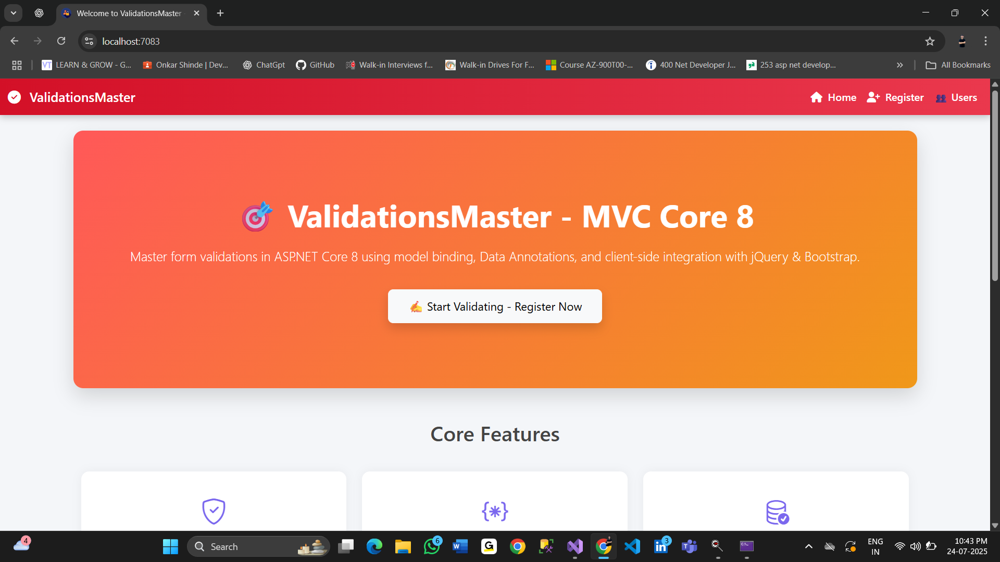
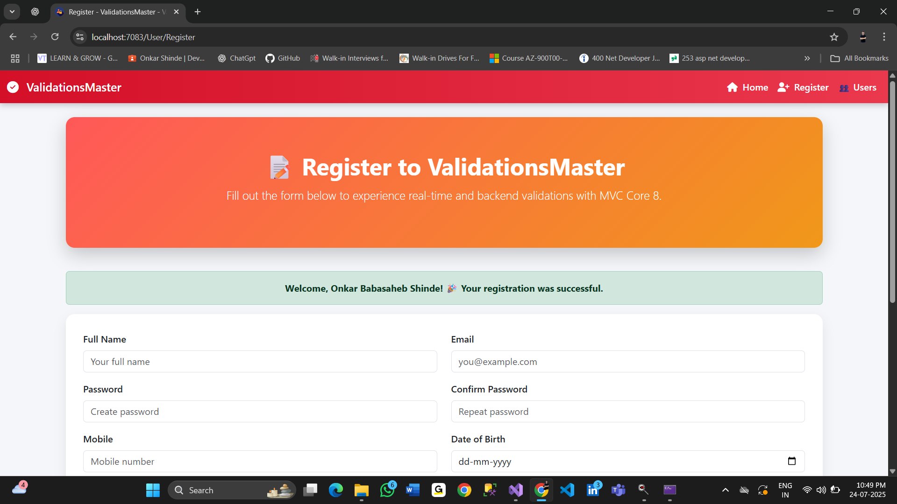
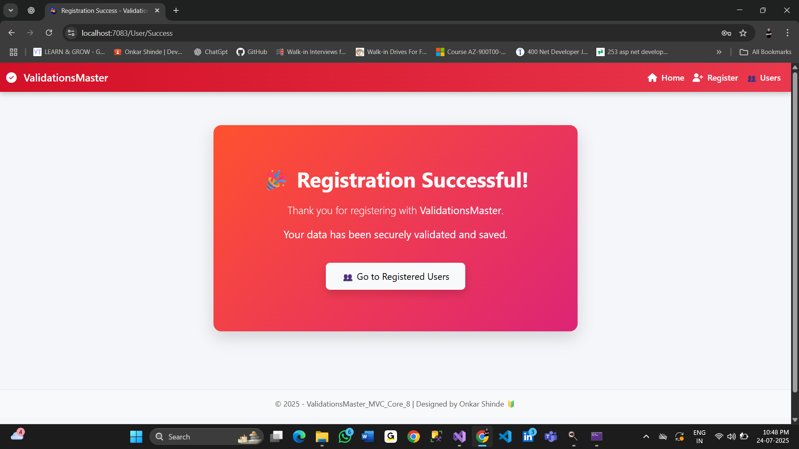
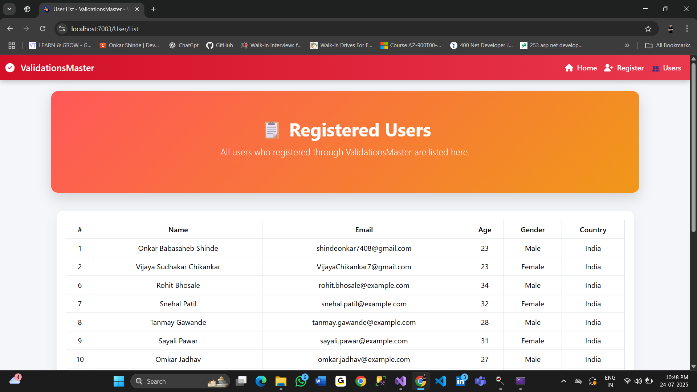

# 🎯 ValidationsMaster-MVC-Core8

A full-featured, modern **ASP.NET Core 8 MVC** project that demonstrates **form validations** with clean UI, client/server validation, and EF Core database integration.

---

## 🚀 What is This Project?

This is a beginner-to-advanced demo that showcases how to build **robust form validations** in ASP.NET Core 8 MVC using:

✅ Data Annotations for model validation  
✅ jQuery Unobtrusive for client-side validation  
✅ EF Core for persisting validated data  
✅ Bootstrap 5 for modern UI  
✅ Razor Views with animations and custom styling  

---

## 🧩 Features

| Feature                    | Description                                                                 |
|---------------------------|-----------------------------------------------------------------------------|
| 🔐 Server-side Validations | Using `[Required]`, `[EmailAddress]`, `[Compare]`, `[Range]`, etc.          |
| ⚡ Client-side Validations | jQuery + Bootstrap feedback for real-time UX                               |
| 📝 User Registration Form  | Fully styled and validated form inputs                                      |
| 📋 User List View          | See registered users using EF Core                                          |

---

## 🌐 Tech Stack

- ASP.NET Core 8 MVC  
- Entity Framework Core  
- SQL Server LocalDb  
- Razor Views  
- Bootstrap 5 + jQuery  
- Client-side & Server-side Validation  

---

## 📂 Project Structure

<pre>
ValidationsMaster-MVC-Core8/
│
├── Controllers/
│   └── UserController.cs
│
├── Models/
│   └── User.cs
│
├── Views/
│   ├── Home/
│   │   └── Index.cshtml
│   └── User/
│       ├── Register.cshtml
│       ├── List.cshtml
│       └── Success.cshtml
│
├── wwwroot/
│   └── Screenshots/
│       ├── Home.png
│       ├── Register.png
│       ├── RegisterSuccess.png
│       └── UserList.png
│
├── Data/
│   └── ProductDbContext.cs
│
├── appsettings.json  
├── Program.cs  
└── README.md
</pre>

---

## 🖼️ Screenshots

### 🏠 Home Page  

### 📝 Register Page  

### ✅ Successfully Registered Page  

### 📋 User List Page  

 
---

## 📄 License

This project is licensed under the [MIT License](https://opensource.org/licenses/MIT).  
You can freely use, modify, and distribute this code.

---

## 👨‍💻 Author

Made with ❤️ by **Onkar Shinde**  
🔗 [GitHub Profile »](https://github.com/onkarshinde2307)

---

## 🤝 Contribution

Pull requests and 🌟 stars are welcome!  
Feel free to fork and extend this project (e.g., AJAX validation, login system, etc.).
